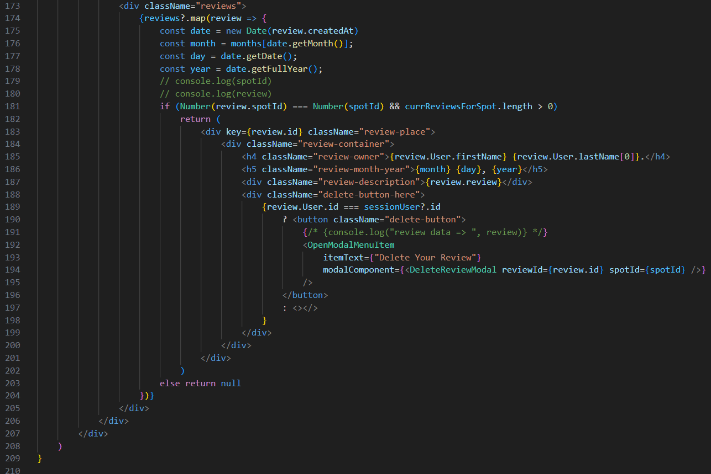

# EarthBnB

Welcome to my Airbnb clone!
Click on the frontend folder to see examples of my features!

## Live at: https://miket-auth-me.onrender.com/ 
## Live link 2 (if above is not working) -> https://earthbnb-2l5p.onrender.com 

## **Technologies Used**
### **Frontend**
- React
- Redux
- JavaScript
- HTML/CSS
### **Backend**
- PostGreSQL
- Express
- Sequelize

## Features Implemented
### **Full CRUD of spots**
### **CRD of reviews**

   [landing]: ../assets/landing.png
   [create-rev]: ../assets/create-review.png
   [create-spot]: ../assets/Create-spot.png
   [del-rev]: ../assets/delete-review.png
   [del-spot]: ../assets/delete-spot.png
   [log-in]: ../assets/log-in.png
   [manage-spots]: ../assets/manage-spots.png
   [sign-up]: ../assets/sign-up.png
   [spot-details]: ../assets/spot-details.png
   [update-spot]: ../assets/Update-spot.png

   [landingGif]: /assets/earthBnBGifs/earthBnB_spotsDemo.gif
   [create-spot-Gif]: /assets/earthBnBGifs/earthBnB_createSpotDemo.gif
   [create-del-rev-gif]: /assets/earthBnBGifs/earthBnB_crudReviewsDemo.gif
   [del-spot-gif]: /assets/earthBnBGifs/earthBnB_deleteSpotDemo.gif
   [log-in-gif]: /assets/earthBnBGifs/earthBnB_logInDemoUser.gif
   [manage-spots-gif]: /assets/earthBnBGifs/earthBnB_manageSpotsPage.gif
   [spot-details-gif]: /assets/earthBnBGifs/earthBnB_spotDetails.gif
   [update-spot-gif]: /assets/earthBnBGifs/earthBnB_updateSpotDemo.gif

1. **Landing Page of All Spots**
   - Displays all spots created by users
   - When hovering over a spot, name of spot is shown
   ![landingGif]
2. **Log In / Sign Up**
   - Log In modal pops up, log in as a demo user
   - Sign Up modal pops up, sign up as a new user
   ![log-in-gif]
3. **Single Spot Details (Read your reviews on each spot!)**
   - When user clicks on a spot in spots page, they are redirected to spot details page
   - User can see information on spot's title, location, host, reviews and photo[s]
   ![spot-details-gif]
4. **Manage your owned Spots**
   - Users can view their owned spots by by clicking the `manage spots` link
   ![manage-spots-gif]
5. **Create, Update, and Delete your spots**
   - Users are able to create a spot
   - Users are able to update a spot's details if they want to change any details
   - Users can delete their spot if they would like
   ![create-spot-gif] ![update-spot-gif] ![del-spot-gif]
6. **Create, Delete a Review**
   - Reviews are displayed on each spot's details page
   - Users are able to post a review if they do not own the spot
   - Users can delete a review if they want to
   ![create-del-rev-gif]

## Future features
### **Reserve feature**

## Code snippet
### **Reviews for each spot**
One of the most challenging features on this project is definitely rendering in reviews on a spot detail's page. In the snippet below, is how I am rendering the reviews.

A problem I faced when first trying to create this feature, was understanding how I am able to grab reviews for each spot.

In order to solve this, I had to first match up the spot to the spot that each review is referring to. I keyed into the review's `spotId` and checked if it matches the `spotId`. With this I was able to render in those reviews.

Another challenge I faced when rendering reviews, was displaying a `delete your review` button to show on the list of reviews. I solved this by saying: if a review's `user ID` matches the currentUser's `id`, we would be able to display that button.

